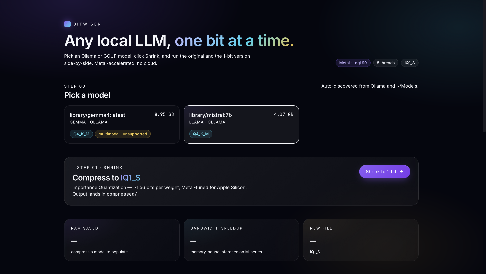
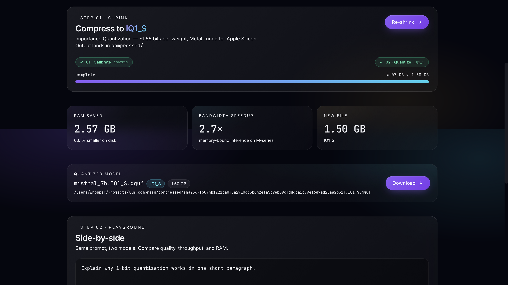
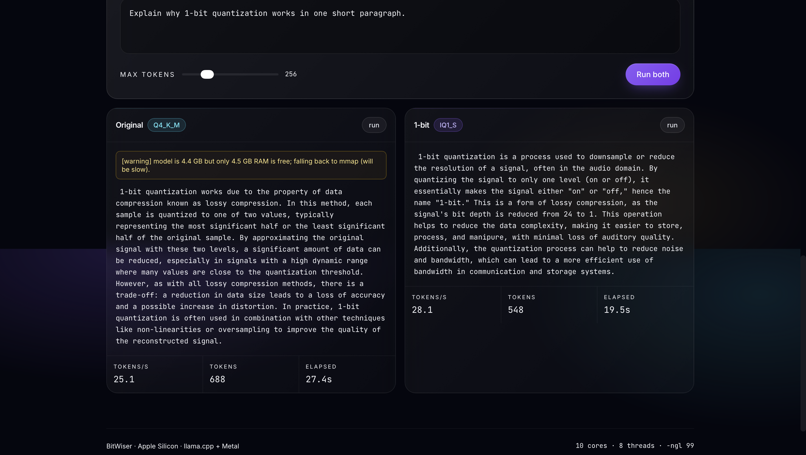

# BitWiser

One-click 1-bit (IQ1_S) compressor for any local LLM on Apple Silicon. FastAPI backend, React frontend, llama.cpp + Metal under the hood.

## Screenshots

**Pick a model** - auto-discovered from Ollama and `~/.models`.



**Shrink to IQ1_S** - importance-matrix calibration, Metal-tuned quantize, live RAM / bandwidth / file-size readout.



**Side-by-side playground** - same prompt, original vs 1-bit, with tokens/sec and elapsed time.



## Install

```bash
brew install cmake
./setup.sh                                  # builds llama.cpp with Metal + Python deps
cd web && npm install                       # frontend deps
```

`setup.sh` produces `vendor/llama.cpp/build/bin/llama-quantize` and `llama-cli`. ~10 minutes the first time.

## Run (dev)

Two terminals:

```bash
# terminal 1 - API
.venv/bin/python server.py                  # http://127.0.0.1:8000

# terminal 2 - UI
cd web && npm run dev                       # http://localhost:5173
```

Vite proxies `/api/*` to the backend, so the UI just calls relative URLs.

## Run (single-process)

```bash
cd web && npm run build                     # emits web/dist/
.venv/bin/python server.py                  # serves the built UI from /
```

## CLI

```bash
.venv/bin/python scanner.py                 # JSON list of discovered models
.venv/bin/python compressor.py "library/gemma4:latest"
```

## Architecture

```
React (Vite + Tailwind v4)  ──▶  FastAPI (server.py)  ──▶  scanner / compressor / inference
       SSE                              SSE                  llama-quantize / llama-cli (Metal)
```

| File | Responsibility |
| --- | --- |
| `scanner.py` | Walks Ollama manifests + local `.gguf`, peeks GGUF headers for arch/quant. |
| `compressor.py` | Wraps `llama-quantize`, streams progress, caches output to `compressed/`. |
| `prompts.py` | Per-family chat templates (Gemma / Llama / Mistral / Phi / Qwen). |
| `inference.py` | Spawns `llama-cli` with optimal threads, `-ngl 99`, mmap fallback for OOM. |
| `monitor.py` | psutil RSS/CPU sampler + optional `powermetrics` wattage. |
| `server.py` | FastAPI: `/api/models`, `/api/compress` (SSE), `/api/inference` (SSE). |
| `web/` | Vite + React + Tailwind v4 frontend. |

## Notes

- **Memory fallback** - if a model is bigger than free RAM, `inference.py` warns the UI and runs with `mmap` so the kernel can page weights from disk.
- **Wattage** - `powermetrics` requires sudo. Configure passwordless sudo (`sudo visudo`) for live energy numbers; otherwise the dashboard estimates from bandwidth.
- **Threads** - runner picks `physical_cores - 2` and offloads all layers to Metal with `-ngl 99`.

## References

The idea that large language models can be aggressively compressed down to roughly 1 bit per weight without catastrophic quality loss comes from:

> **The Era of 1-bit LLMs: All Large Language Models are in 1.58 Bits**
> Shuming Ma, Hongyu Wang, Lingxiao Ma, Lei Wang, Wenhui Wang, Shaohan Huang, Li Dong, Ruiping Wang, Jilong Xue, Furu Wei (Microsoft Research), 2024.
> [arxiv.org/pdf/2402.17764](https://arxiv.org/pdf/2402.17764)

That paper introduces **BitNet b1.58**, a Transformer variant whose weights are constrained to the ternary set {-1, 0, +1} (≈1.58 bits/weight) and still matches full-precision baselines on perplexity and downstream tasks while dramatically reducing memory, bandwidth, and energy. BitWiser is a practical, post-hoc analogue: instead of training a model in 1.58-bit form, it takes any already-trained GGUF and uses llama.cpp's **IQ1_S** (≈1.56 bits/weight, importance-matrix guided) quantization to hit a similar regime on a laptop. Quality is not preserved as well as in BitNet b1.58 — that's the price of compressing after the fact rather than training natively — but the speed and RAM wins translate directly.

Credit for the underlying inference and quantization tooling goes to [ggml-org/llama.cpp](https://github.com/ggml-org/llama.cpp) and its contributors, particularly the authors of the IQ-quant family (Kawrakow et al.).
